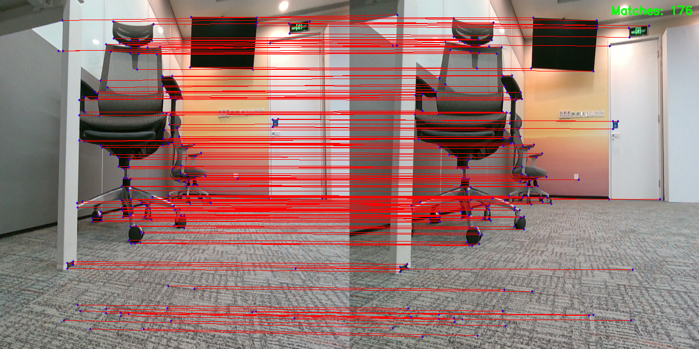

# DFeat + LightGlue X5 Infer Code

# 模型介绍（model文件夹）

- dfeat_640_640.bin: DFeat特征点提取模型，输入640*640的图片，输出特征点和描述子
- dfeat.bin: DFeat特征点提取模型，输入640*480的图片，输出特征点和描述子
- lg_v2.bin: LightGlue特征点匹配网络，输入特征点和描述子，输出匹配结果和对应的得分（描述子256维）
- lg_dfeat_kp192.bin: LightGlue特征点匹配网络，输入特征点和描述子，输出匹配结果和对应的得分（描述子192维）

# 编译

- 首先需要安装编译器
  - 下载地址：https://developer.arm.com/downloads/-/arm-gnu-toolchain-downloads
  - 本例使用的是arm-gnu-toolchain-11.3.rel1-x86_64-aarch64-none-linux-gnu.tar.xz，请下载对应版本并解压
    ```bash
    tar -xvf arm-gnu-toolchain-11.3.rel1-x86_64-aarch64-none-linux-gnu.tar.xz -C /opt
    ```
- 修改run_build.sh文件，将里面的改为解压的编译器绝对路径
```bash
-DCMAKE_C_COMPILER=/opt/arm-gnu-toolchain-11.3.rel1-x86_64-aarch64-none-linux-gnu/bin/aarch64-none-linux-gnu-gcc \
-DCMAKE_CXX_COMPILER=/opt/arm-gnu-toolchain-11.3.rel1-x86_64-aarch64-none-linux-gnu/bin/aarch64-none-linux-gnu-g++
```
- 最后执行`bash run_build.sh`即可编译，可以在EVB/RDK X5板端编译，或者在PC端Ubuntu 22.04系统交叉编译，`run_build.sh`脚本均可运行

# X5芯片运行

需要将build目录生成的`DFMatch_X5.tar.gz`文件复制到`/userdata`（或者自定义目录）

然后在`/userdata/DFMatch`目录执行

```
bash make_ln.sh
```

最后运行程序

```bash
# 指定OpenCV目录
export LD_LIBRARY_PATH=${LD_LIBRARY_PATH}:/userdata/lib_opencv4.5.4/lib/
# 参数1指定dfeat模型，参数2指定lg模型
./dfmatch_infer ./model/dfeat_640_640.bin ./model/lg_v2.bin
./dfmatch_infer ./model/dfeat.bin ./model/lg_dfeat_kp192.bin
./dfmatch_infer ./model/dfeat.bin ./model/lg_dfeat.bin
```

程序将读取build目录下的image_test文件夹的图像，将可视化结果保存在build目录下的image_vis文件夹中

# 可调参数

【特征提取模型说明】

dfeat模型输入为640*640的灰度图像

模型输出为原图尺寸对应的 特征点点feature map（1x1x640x640）和描述子feature map（1x640x640x256）

经过后处理，得到特征点位置信息和对应描述子信息

【特征提取参数说明】

point_th_high：特征点筛选置信度，默认值0.012

point_th_low：如果特征点筛选置信度过高，会启用该阈值，默认值0.007

windowSize：nms算法邻域窗口大小，默认值5

【特征匹配模型说明】：

lightglue进行256个特征点的匹配

lightglue输入依赖于dfeat输出的关键点和描述子，需要先对两张匹配图像分别输入dfeat模型进行处理

lightglue的四个输入分别为：

图像0归一化后关键点位置信息——kpts0   1 * 256 *  2 *  1

图像1归一化后关键点位置信息——kpts1   1 * 256 *  2 *  1

图像0描述子信息——desc0               1 * 256 *  256 *  1

图像1描述子信息——desc1               1 * 256 *  256 *  1


lightglue会输出两幅图像特征点匹配关系，两个输出分别为：

两幅图像特征点索引对应匹配关系——matches0          256 * 2 *  1 *  1

两幅图像特征点匹配对的得分——mscores0              256 * 1 *  1 *  1

# 结果


